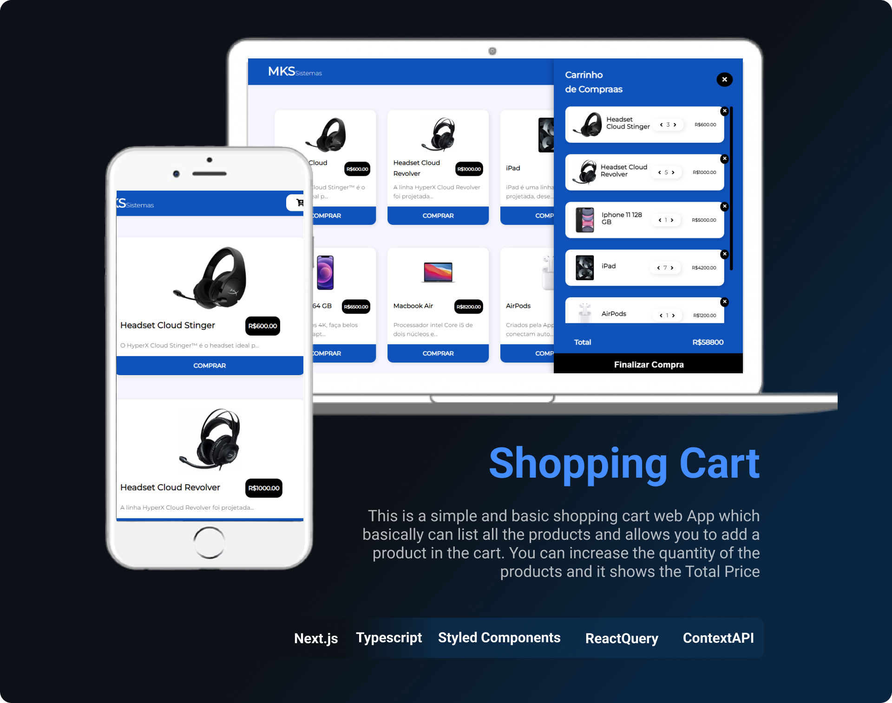

# MKS FRNTEND CHALLENGE
## Shopping Cart Web app
This is a simple and basic shopping cart web App which basically can list all the products and allows you to add a product in the cart. You can increase the quantity of the products and it shows the Total Price 

[See the app](https://mks-challenge-mario.netlify.app)



### Technologies
* Next.js
* React Hooks
* React Query
* Typescript
* Styled-Components
* React Context

---
---

### Instalation
```Bash
  npm install
``` 
---
---

### Run
```Bash
  npm run dev
```
---
---
